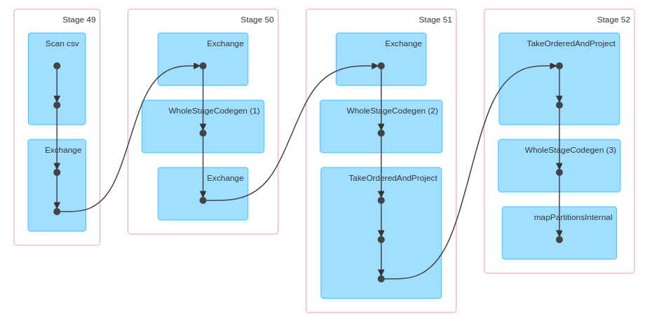

# DEZ Week 5

See [the notebook here!](./W5.ipynb)


# Q1

Typing `spark.version` returns `3.0.3`


# Q2


```
!ls -lhR fhvhv/2021/02/
```

Ans: 208 MB

# Q3

```
from pyspark.sql import functions as F
df_mod = df \
    .withColumn('pickup_date', F.to_date(df.pickup_datetime)) \
    .withColumn('dropoff_date', F.to_date(df.dropoff_datetime)) \
    .select('pickup_date', 'dropoff_date', 'PULocationID', 'DOLocationID')
df_feb15 = df_mod.filter("pickup_date == '2021-02-15'")
print(f'No. of Records Starting on Feb 15: {df_feb15.count()}')
```
Answer: 367170


# Q4

```
df_mod_q4 = df \
    .withColumn('pickup_date', F.to_date(df.pickup_datetime)) \
    .withColumn('duration', (F.unix_timestamp(df.dropoff_datetime) - F.unix_timestamp(df.pickup_datetime))) \
    .show()

df_mod_q4 \
    .select('pickup_date', 'duration') \
    .sort(df_mod_q4.duration.desc()) \
    .show()
```
Answer: 2021-02-11


# Q5



Ans: 4

# Q6

```
spark.sql("""
SELECT
    CONCAT(zpu.zone, ' / ', zdo.zone) as pd,
    COUNT(*) as count
FROM
    trips_data t,
    zones_data zpu,
    zones_data zdo
 WHERE
    t.PULocationID = zpu.LocationID AND
    t.DOLocationID = zdo.LocationID
GROUP BY
    pd
ORDER BY
    count DESC
LIMIT 
    5;
""").show(truncate=False)
```
Answer: East New York / East New York